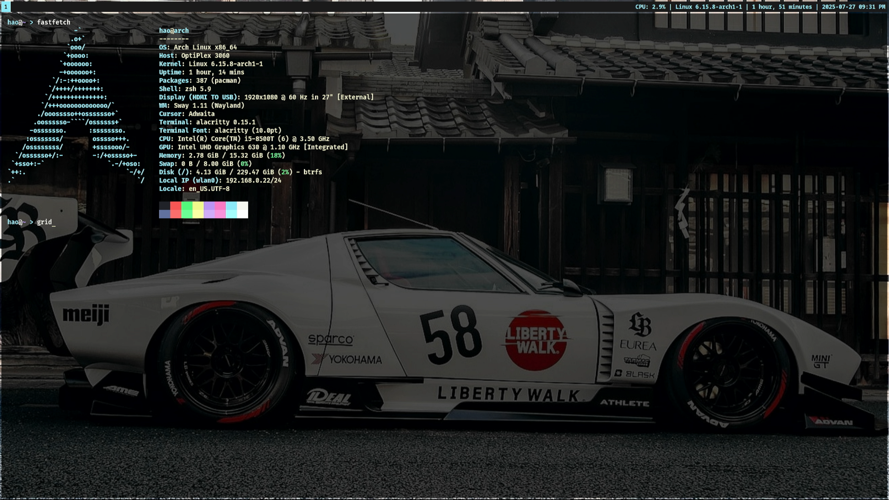

# Dotfiles

This is my personal dotfiles repository, which only contains some configurations and simple scripts.

### Screenshot：

    
    
Programming Workstation and Intranet Server

### List：

 - Alacritty : : *`~/.config/alacritty/*`*
 - My Toolkit : : *`~/.mytoolkit/*`*
 - Sway : : *`~/.config/sway/*`*
 - Zsh : : *`~/.zsh*`*